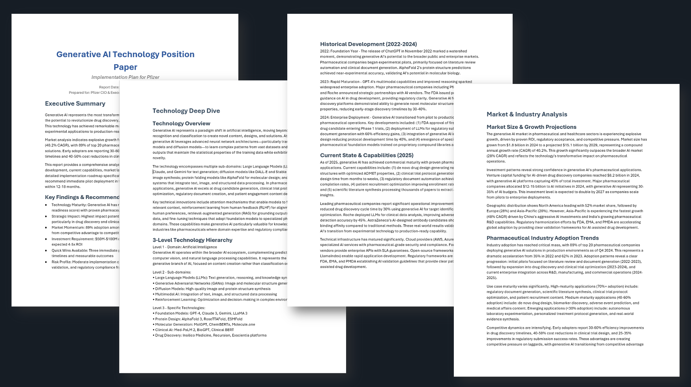

<div align="center">

## TechRecon: Your AI Reconnaissance agent
[](https://registration.awsevents.com/flow/awsevents/reinvent2025/eventcatalog/page/eventcatalog?trk=direct&search=SNR203) []() []()
<br> powered by 💗 [aws sample-deep-insight](https://github.com/aws-samples/sample-deep-insight)

</div>

## 📝 Introduction
**Project TechRecon** designed to help enterprise leaders master the overwhelming pace of technological change. Addressing a packed executive audience at re:invent 2025, we're introducing a methodology that reframes technology scouting from a manual, reactive task into a dynamic, automated strategic intelligence operation.

- re:Invent 2025
    - A leader's guide to emerging technologies: From insights to rapid action(Track SNR203)


<br />


### Web Interface Screenshot


### Results

|Part 1: Landscape Analysis|
|:---:|
||

|Part 2: Technical Position Papers|
|:---:|
||


## 🖥️ Tech Recon Web Interface

A web application to run and monitor the Tech Recon project.

## Key Features

- **Real-time Log Streaming**: Monitor execution progress in real-time through WebSocket
- **Part1/Part2 Execution**: Run processes with button clicks in the web UI
- **File Download**: Download generated artifact files individually or as ZIP archives
- **Visual Monitoring**: View execution status, log count, file count at a glance

## 🛠️ How to start

## Installation
### 1. Install uv (First Time Only)

```bash
# Install uv (macOS/Linux)
curl -LsSf https://astral.sh/uv/install.sh | sh

# Or use Homebrew (macOS)
brew install uv

# Verify installation
uv --version
```

### 2. Create Virtual Environment and Install Packages

```bash
# Navigate to project directory
cd aws-samples/sample-tech-recon

# Create virtual environment and install dependencies (based on pyproject.toml)
uv sync
```

This single command automatically installs all web-related packages including Flask.

### 2. Configure Environment Variables

Create a `.env` file in the project root directory and configure the following environment variables:

```bash
# Create .env file
cd aws-samples/sample-tech-recon
touch .env
```

#### [Required] Environment Variables

**AWS Configuration** (Required)
```
# AWS Region
AWS_DEFAULT_REGION=us-west-2

# AWS Profile (optional, not needed when using IAM Role)
AWS_PROFILE=your-profile-name
```

#### [Optional] Environment Variables

**Tavily Search** (for research)
```
# Tavily API Key (for web search functionality)
TAVILY_API_KEY=your-tavily-api-key

# Maximum search results (default: 5)
TAVILY_MAX_RESULTS=5
```

#### Example .env File

```bash
# AWS Bedrock Configuration
AWS_DEFAULT_REGION=us-west-2

# Optional: Tavily Search (for research)
# TAVILY_API_KEY=tvly-xxxxxxxxxxxxx
# TAVILY_MAX_RESULTS=5
```

#### AWS Authentication Methods

This project supports the following AWS authentication methods:

1. **IAM Role** (Recommended for SageMaker environment)
   - Set only `AWS_DEFAULT_REGION` in `.env` file
   - IAM Role automatically handles authentication

2. **AWS Profile**
   - Configure profile in `~/.aws/credentials`
   - Set `AWS_PROFILE` in `.env` file

3. **Environment Variables**
   - Directly set `AWS_ACCESS_KEY_ID` and `AWS_SECRET_ACCESS_KEY` (not recommended)

#### Permission Requirements

Your AWS account/role must have the following permissions:
- `bedrock:InvokeModel`
- `bedrock:InvokeModelWithResponseStream`
- Other Bedrock-related read permissions

## Start the web application

### Method 1: Using Start Script (Recommended)

```bash
# Navigate to project directory
cd aws-samples/sample-tech-recon

# Run the start script
./start_web.sh
```
When the web server starts, you'll see this message:

```
============================================================
Tech Recon Web Application
============================================================
Server starting at: http://localhost:5000
Press Ctrl+C to stop the server
============================================================
```

### Method 2: Manual Execution in terminal

```bash
# Navigate to project directory
cd aws-samples/sample-tech-recon

# Activate virtual environment
source uv run python main.py
```
If you run the code in terminal, all files will be saved in artifacts/part1 or artifacts/part2.


## Web application manual

### 1. Access Web Browser

```
http://localhost:5000
```

Since it's running locally, access the above address in your browser.

### 2. Execution

1. Click **Run Part1** or **Run Part2**(only after the part1) button
2. Click "OK" in the confirmation dialog
3. Monitor progress in the real-time log screen

### 3. Log Monitoring

- **Real-time Logs**: View logs in real-time in the left panel
- **Auto-scroll**: Enabled by default, can be toggled
- **Clear Logs**: Clear the screen with the "Clear Logs" button

### 4. File Download

#### Individual File Download
- Click the "Download" button for each file in the "Generated Files" section on the right panel

#### Bulk File Download (ZIP)
- **Download Part1**: Download all files generated in Part1 as ZIP
- **Download Part2**: Download all files generated in Part2 as ZIP
- **Download All**: Download all files from Part1 and Part2 in a single ZIP

## Important Notes

1. **Firewall**: Port 5000 must be open
2. **Concurrent Execution**: Only one Part can run at a time (Part1 -> Part2)
3. **Browser Compatibility**: Latest versions of Chrome, Firefox, Safari, Edge recommended
4. **Network**: Accessible only from local network (0.0.0.0:5000)

## License

This project follows the license of the original Tech Recon project.

## Contact

If you encounter any issues or have suggestions for improvements, please submit an issue.
